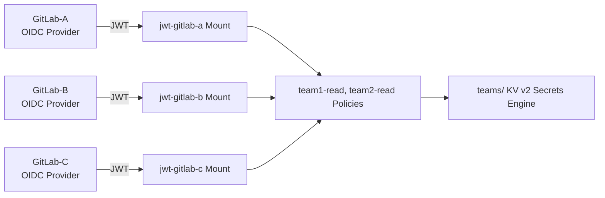
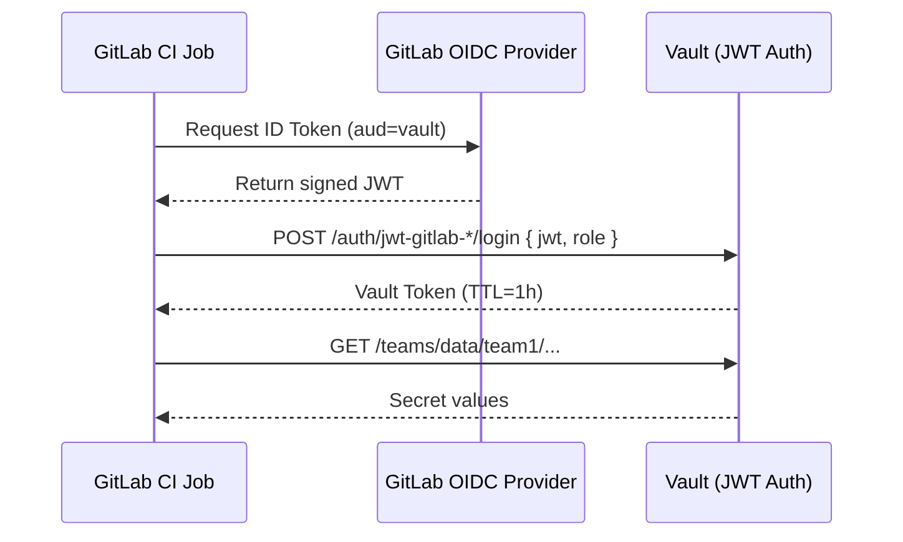

# 🚀 Multi-Instance GitLab → HashiCorp Vault Integration Using JWT
*A Real-World Enterprise DevOps Case Study Implemented Across Multiple GitLab Environments*

This repository demonstrates how to securely integrate **multiple independent GitLab instances** with **HashiCorp Vault** using **OIDC/JWT authentication**, allowing CI/CD pipelines to retrieve secrets without storing long-lived credentials.

The design is based on a real-world engineering scenario, generalized for public use.

---

## 🧭 1. Problem Overview

Organizations often operate **multiple GitLab servers** (different network zones, customer boundaries, legacy setups).  
These instances require access to centralized secrets in Vault, but:

- Static CI variables are insecure
- Long-lived Vault tokens violate zero-trust
- GitLab instances must remain isolated
- Teams must not see other teams' secrets

This repository provides a **secure, scalable, production-ready solution**.

---

## 🏗 2. High-Level Architecture

### Core concepts:

- One Vault JWT auth mount **per GitLab instance**
- One Vault policy **per team**
- Shared KV v2 mount (`teams/`)
- GitLab OIDC → Vault JWT → ephemeral Vault token
- Reusable GitLab CI template

---

## 🖼 Architecture Diagram (Mermaid)


## 🔄 3. Authentication Flow



## 📁 4. Repository Structure

```pgsql
gitlab-vault-jwt-integration/
├── README.md
├── diagrams/
│   ├── architecture.mmd
│   └── auth-flow.mmd
├── policies/
│   ├── team1-read.hcl
│   └── team2-read.hcl
├── roles/
│   ├── team1-gitlab-a.json
│   ├── team1-gitlab-b.json
│   ├── team1-gitlab-c.json
│   ├── team2-gitlab-a.json
│   ├── team2-gitlab-b.json
│   └── team2-gitlab-c.json
├── ci/
│   └── fetch_vault_secrets.yml
└── scripts/
    └── provision.sh
```

## 🔐 5. Vault Policies

`policies/team1-read.hcl`
```hcl
path "teams/data/team1/*" {
  capabilities = ["read"]
}

path "teams/metadata/team1/*" {
  capabilities = ["read", "list"]
}
```

`policies/team2-read.hcl`
```hcl
path "teams/data/team2/*" {
  capabilities = ["read"]
}

path "teams/metadata/team2/*" {
  capabilities = ["read", "list"]
}
```

## 🧩 6. Vault JWT Roles (Per Team × Per GitLab)

Example: team1 on gitlab-A

`roles/team1-gitlab-a.json`
```json
{
"role_type": "jwt",
"token_policies": ["team1-read"],
"token_ttl": "1h",
"token_explicit_max_ttl": 3600,
"bound_issuer": "https://gitlab-A.company.com",
"bound_audiences": ["vault"],
"user_claim": "sub",
"user_claim_json_pointer": "/sub",
"clock_skew_leeway": 60
}
```
Repeat for team1/team2 on gitlab-{a,b,c}.


## 🧬 7. Reusable GitLab CI Template

`ci/fetch_vault_secrets.yml`

```yaml
.fetch-vault-secrets:
  stage: fetch
  id_tokens:
    VAULT_ID_TOKEN:
      aud: vault
  script:
    - set -euo pipefail
    - export VAULT_ADDR="${VAULT_ADDR:-http://vault:8200}"

    # install jq safely
    - |
      JQ_DIR="${CI_PROJECT_DIR}/.bin"; mkdir -p "$JQ_DIR"
      if ! "$JQ_DIR/jq" --version &>/dev/null; then
        curl -fsSL -o "$JQ_DIR/jq.tmp" https://github.com/stedolan/jq/releases/download/jq-1.7/jq-linux64
        chmod 755 "$JQ_DIR/jq.tmp"
        mv "$JQ_DIR/jq.tmp" "$JQ_DIR/jq"
      fi
      export PATH="$JQ_DIR:$PATH"

    # validate required vars
    - |
      : "${VAULT_JWT_MOUNT:?missing}"
      : "${VAULT_JWT_ROLE:?missing}"
      : "${VAULT_SECRET_PATH:?missing}"
      VAULT_KV_MOUNT="${VAULT_KV_MOUNT:-teams}"

    # login using JWT
    - |
      LOGIN_JSON=$(curl -sS -X POST "$VAULT_ADDR/v1/auth/$VAULT_JWT_MOUNT/login" \
        -H "Content-Type: application/json" \
        -d "{\"role\":\"$VAULT_JWT_ROLE\", \"jwt\":\"$VAULT_ID_TOKEN\"}")
      VAULT_TOKEN=$(echo "$LOGIN_JSON" | jq -r '.auth.client_token')

    # fetch secrets
    - |
      RESP=$(curl -sS -H "X-Vault-Token:$VAULT_TOKEN" \
        "$VAULT_ADDR/v1/$VAULT_KV_MOUNT/data/$VAULT_SECRET_PATH")
      mkdir -p artifacts
      : > artifacts/vault.env
      for K in $(echo "$RESP" | jq -r '.data.data | keys[]'); do
        echo "$K=$(echo "$RESP" | jq -r --arg k "$K" '.data.data[$k]')" \
          >> artifacts/vault.env
      done

  artifacts:
    reports:
      dotenv: artifacts/vault.env
    expire_in: 6h
```

Example usage:
```yaml
fetch-team1-secrets:
  extends: .fetch-vault-secrets
  variables:
    VAULT_JWT_MOUNT: "jwt-gitlab-a"
    VAULT_JWT_ROLE: "team1"
    VAULT_SECRET_PATH: "team1/ci/gitlab"
```
For a detailed explanation of how the `fetch_vault_secrets.yml` job works, see:

➡️ **[fetch_job.md](./fetch_job.md)**

## 🛠 8. Provisioning Script
`scripts/provision.sh`

```yaml
#!/usr/bin/env bash
set -euo pipefail

VAULT_ADDR="${VAULT_ADDR:-http://vault:8200}"
VAULT_TOKEN="${VAULT_TOKEN:?VAULT_TOKEN not set}"

AUTH_MOUNTS=(gitlab-a gitlab-b gitlab-c)
TEAMS=(team1 team2)

echo "[+] Creating JWT auth mounts..."
for MOUNT in "${AUTH_MOUNTS[@]}"; do
  if ! vault auth list | grep -q "jwt-$MOUNT/"; then
    vault auth enable -path="jwt-$MOUNT" jwt
    echo "Enabled mount jwt-$MOUNT"
  else
    echo "Mount jwt-$MOUNT already exists, skipping"
  fi
done

echo "[+] Applying policies..."
for TEAM in "${TEAMS[@]}"; do
  vault policy write "${TEAM}-read" "policies/${TEAM}-read.hcl"
done

echo "[+] Applying roles..."
for TEAM in "${TEAMS[@]}"; do
  for MOUNT in "${AUTH_MOUNTS[@]}"; do
    ROLE="roles/${TEAM}-gitlab-${MOUNT}.json"
    vault write "auth/jwt-${MOUNT}/role/${TEAM}" @"$ROLE"
  done
done

echo "[✓] Provisioning complete!"
```

## 🔒 9. Security Principles Applied

Zero-trust CI/CD

Short-lived Vault tokens

Team isolation (team1/team2)

GitLab instance isolation

OIDC-based authentication

No long-lived credentials

Easy revocation and rotation

