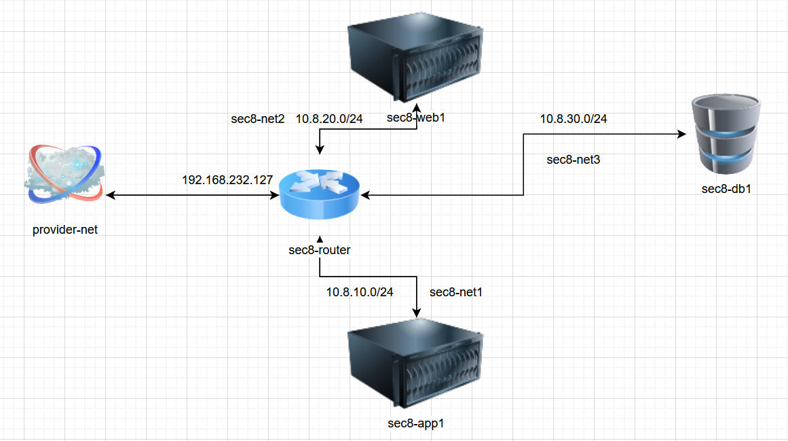

# OpenStack 3-Tier Networking Lab (Kolla-Ansible)

## Project Description

This project documents a hands-on **3-tier network architecture** implemented using **OpenStack Neutron** in a **single-node Kolla-Ansible lab environment**.

The purpose of the lab is to:
- Understand Neutron routing and segmentation
- Validate east-west and north-south traffic flows
- Apply tier-based security using security groups
- Observe real OpenStack networking behavior during troubleshooting

This is a **learning and portfolio project**, intentionally CLI-driven and verbose.

---

## Architecture Summary

### Network Diagram

The diagram below represents the final topology used in this lab.



---

### Networks

| Network | CIDR | Purpose |
|------|------|------|
| sec8-net1 | 10.8.10.0/24 | Web tier |
| sec8-net2 | 10.8.20.0/24 | App tier |
| sec8-net3 | 10.8.30.0/24 | DB tier |
| provider-net | 192.168.232.0/24 | External access |

### Router

- Name: `sec8-router`
- External gateway: provider-net
- SNAT enabled
- Interfaces on all internal subnets

---

## Initial State – Instances

> **Note:** The first two instances (`sec8-web1` and `sec8-app1`) were created previously as part of earlier lab steps.  
> This project continues from that existing state.

### List servers

```
openstack server list
+--------------------------------------+-----------+---------+---------------------------------------+---------------+---------+
| ID                                   | Name      | Status  | Networks                              | Image         | Flavor  |
+--------------------------------------+-----------+---------+---------------------------------------+---------------+---------+
| 52ea823b-b914-44db-84fe-688174122a07 | sec8-app1 | SHUTOFF  | sec8-net2=10.8.20.59                  | public-cirros | m1.tiny |
| 0597c587-a915-46c6-bb94-18eec255ac4f | sec8-web1 | SHUTOFF  | sec8-net1=10.8.10.51, 192.168.232.127 | public-cirros | m1.tiny |
| 17790310-3c93-40e3-ad44-7ad68b3601ab | vm1       | SHUTOFF | provider-net=192.168.232.122          | public-cirros | m1.tiny |
+--------------------------------------+-----------+---------+---------------------------------------+---------------+---------+
```

## Floating IP Connectivity Test

Assigned Floating IP

```
FIP_WEB=192.168.232.127
```

Ping Floating IP (initial failure)

```
ping -c 3 $FIP_WEB

PING 192.168.232.127 (192.168.232.127) 56(84) bytes of data.
From 192.168.232.127 icmp_seq=1 Destination Host Unreachable
From 192.168.232.127 icmp_seq=2 Destination Host Unreachable
From 192.168.232.127 icmp_seq=3 Destination Host Unreachable
```

At this point, instances were `SHUTOFF`, causing unreachable errors.

## Instance State Fix

1. Check instance state

```
openstack server list

| sec8-web1 | SHUTOFF |
| sec8-app1 | SHUTOFF |
```

2. Start instances

```
openstack server start sec8-app1
openstack server start sec8-web1
```

3. Verify status

```
openstack server list

| sec8-app1 | ACTIVE |
| sec8-web1 | ACTIVE |
```

4. Floating IP Connectivity (After Fix)

```
ping -c 3 192.168.232.127

64 bytes from 192.168.232.127: icmp_seq=1 ttl=63 time=9.10 ms
64 bytes from 192.168.232.127 icmp_seq=2 ttl=63 time=3.79 ms
```

SSH via Floating IP (labkey.pem is integrated to all deployed VM's)

```
ssh -i ~/labkey.pem cirros@192.168.232.127
```

Web VM reachable by SSH

## Internal Connectivity – Web → App

```
ssh -i ~/labkey.pem cirros@192.168.232.127 "ping -c 3 10.8.20.59"

64 bytes from 10.8.20.59: icmp_seq=1 ttl=63 time=5.79 ms
64 bytes from 10.8.20.59: icmp_seq=2 ttl=63 time=2.12 ms
```

Direct ping from controller (fails as expected):

```
ping -c 3 10.8.20.59

100% packet loss
```
**NOTE**: 
This is expected behavior, as the controller node is not attached to tenant networks and does not participate in Neutron routing namespaces.

## Extending the Topology – Adding the DB Tier
## Create DB Network (sec8-net3)

```
openstack network create sec8-net3

| name | sec8-net3 |
| status | ACTIVE |
```

```
openstack subnet create --network sec8-net3 --subnet-range 10.8.30.0/24 --gateway 10.8.30.1 sec8-subnet3
```

```
| cidr | 10.8.30.0/24 |
| gateway_ip | 10.8.30.1 |
```

```
openstack router add subnet sec8-router sec8-subnet3
```

Verify Router Interfaces

```
openstack router show sec8-router -c interfaces_info -c external_gateway_info
```

interfaces_info:
- 10.8.20.1
- 10.8.10.1
- 10.8.30.1

external_gateway_info:
- 192.168.232.108

## Create DB Security Group

```
openstack security group create --description "DB tier ingress rules" sec8-db-sg

| name | sec8-db-sg |
```

Allow ICMP from App Tier Only

```
openstack security group rule create sec8-db-sg --protocol icmp --remote-group sec8-app-sg

| protocol | icmp |
| direction | ingress |
| remote_group | sec8-app-sg |
```

This means:

The DB instances accept ICMP traffic only from instances that belong to `sec8-app-sg`
* No fixed CIDR ranges are required
* If App-tier instances are recreated or their IPs change, the rule continues to work automatically

This approach provides:
* Dynamic and scalable security rules
* Clear tier-to-tier trust boundaries
* Behavior closer to production-grade micro-segmentation

Using --remote-group is preferred over static CIDR rules in environments where instances are ephemeral or frequently rebuilt.


## Launch DB Instance

```
openstack server create --flavor m1.tiny --image public-cirros --network sec8-net3 --security-group sec8-db-sg --security-group ssh-provider --key-name labkey sec8-db1
```

```
openstack server list

| sec8-db1 | ACTIVE | sec8-net3=10.8.30.195 |
```

## App → DB Connectivity Test

```
ssh -i ~/labkey.pem cirros@192.168.232.127

ssh cirros@10.8.20.59
```
Ping DB server
```
ping -c 3 10.8.30.195 

64 bytes from 10.8.30.195: icmp_seq=1 ttl=63 time=3.2 ms
```
SSH to DB server (SSH access is allowed via the ssh-provider security group, which permits controlled administrative access across tiers in the lab.)
```
ssh cirros@10.8.30.195

hostname
sec8-db1
```

## Final Server State

```
openstack server list -c name -c status -c networks

| sec8-web1 | ACTIVE | sec8-net1=10.8.10.51, 192.168.232.127 |
| sec8-app1 | ACTIVE | sec8-net2=10.8.20.59 |
| sec8-db1  | ACTIVE | sec8-net3=10.8.30.195 |
```

## Notes & Known Issues (CirrOS & Lab Behavior)

### 1. SCP Failures

```
/usr/libexec/sftp-server: not found
```

Reason:
- CirrOS image does not include sftp-server
- SCP is not supported out of the box

### 2. SSH Authentication

- CirrOS may request password even with SSH keys
- Default user: `cirros`
- Password authentication is enabled by design
- Default password: `gocubsgo`

## Purpose of This Project

- Learn OpenStack Neutron deeply
- Practice real troubleshooting
- Demonstrate tier-based security
- Serve as a portfolio artifact

## Author

Tudor

DevOps Engineer

OpenStack · Linux · Networking · Automation
